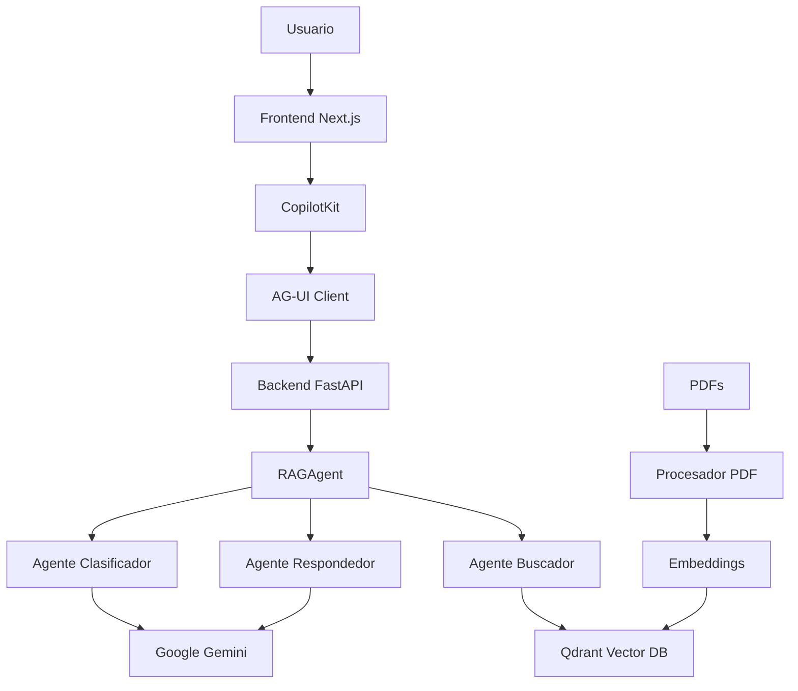

# 🎓 Asistente de Física I - UBA

Sistema de chatbot inteligente con RAG (Retrieval-Augmented Generation) para consultas de Física I de la Universidad de Buenos Aires. Utiliza Google ADK, AG-UI, CopilotKit y Qdrant para proporcionar respuestas basadas en documentos del curso.

## 🌟 Características

- ✅ Sistema RAG completo con búsqueda vectorial en documentos PDF
- ✅ Agentes especializados (clasificador, buscador, respondedor)
- ✅ Memoria de conversación semántica
- ✅ Interfaz de chat moderna con Next.js y CopilotKit
- ✅ Backend Python con Google ADK y FastAPI
- ✅ Base de datos vectorial Qdrant para búsqueda semántica
- ✅ Procesamiento automático de PDFs

## 📋 Requisitos Previos

- **Node.js** >= 18.0.0
- **Python** >= 3.13
- **uv** (gestor de paquetes Python) - [Instalación](https://github.com/astral-sh/uv)
- **Qdrant** (base de datos vectorial) - Puede ser local o en la nube
- **API Key de Google Gemini** - [Obtener aquí](https://makersuite.google.com/app/apikey)

## 🚀 Instalación Rápida

### 1. Clonar el repositorio

```bash
git clone <tu-repositorio>
cd agui_test
```

### 2. Configurar variables de entorno

Crea un archivo `.env` en la raíz del proyecto:

```env
# Google Gemini API
GOOGLE_API_KEY=tu_google_api_key_aqui

# Qdrant Configuration
QDRANT_URL=https://tu-cluster-qdrant.cloud:6333
QDRANT_KEY=tu_qdrant_api_key_aqui
QDRANT_COLLECTION_NAME=documentos_pdf

# PDF Directory (opcional, por defecto ./pdfs)
DIR_PDF=/ruta/a/tus/pdfs

# Backend URL (para el frontend)
BACKEND_URL=http://localhost:8000

# Langfuse (opcional - para observabilidad)
# LANGFUSE_SECRET_KEY=tu_secret_key
# LANGFUSE_PUBLIC_KEY=tu_public_key
# LANGFUSE_HOST=https://cloud.langfuse.com
```

### 3. Instalar dependencias

#### Frontend (Next.js)
```bash
npm install
```

#### Backend (Python)
```bash
cd agent
uv sync
# o si prefieres pip:
# pip install -r requirements.txt
cd ..
```

### 4. Preparar documentos PDF

Coloca tus archivos PDF de Física en el directorio especificado en `DIR_PDF` (por defecto `./pdfs`):

```bash
mkdir pdfs
# Copia tus PDFs aquí
cp /ruta/a/tus/pdfs/*.pdf pdfs/
```

### 5. Ejecutar la aplicación

#### Opción 1: Sistema Base (Sin Optimización)

```bash
npm run dev
```

Esto iniciará:
- Frontend en `http://localhost:3000`
- Backend en `http://localhost:8000`

#### Opción 2: Sistema Optimizado con DSPy GEPA

El proyecto incluye un agente optimizado en el directorio `agent_gepa` que utiliza DSPy GEPA para mejorar automáticamente los prompts.

**Paso 1: Instalar dependencias del agente optimizado**

```bash
cd agent_gepa
uv sync
cd ..
```

**Paso 2: (Opcional) Ejecutar optimización de prompts**

Si quieres re-optimizar los prompts con tus propios datos:

```bash
cd agent_gepa
uv run optimizer.py
cd ..
```

Este proceso:
- Utiliza GEPA (Genetic-Pareto) para evolucionar los prompts
- Evalúa cada variante con métricas de calidad
- Guarda el mejor modelo en `optimized_responder.json`
- Toma aproximadamente 30 segundos con 5 ejemplos

**Paso 3: Ejecutar el sistema optimizado**

```bash
npm run dev:gepa
```

Esto iniciará:
- Frontend en `http://localhost:3000`
- Backend optimizado en `http://localhost:8001`
- Frontend automáticamente conectado al puerto 8001

**Diferencias entre Sistema Base y Optimizado:**

| Característica | Base (`agent/`) | Optimizado (`agent_gepa/`) |
|---------------|-----------------|----------------------------|
| **Prompts** | Estáticos | Optimizados con GEPA |
| **Puerto** | 8000 | 8001 |
| **Startup** | Rápido | Con caché: rápido |
| **Calidad** | Buena | Mejorada automáticamente |
| **Uso** | Desarrollo | Producción |

## 📁 Estructura del Proyecto

```
agui_test/
├── agent/                      # Backend Python
│   ├── agent.py               # Aplicación principal con RAG
│   ├── pyproject.toml         # Dependencias Python (uv)
│   ├── requirements.txt       # Dependencias Python (pip)
│   └── .venv/                 # Entorno virtual Python
├── src/                       # Frontend Next.js
│   └── app/
│       ├── page.tsx           # Interfaz del chat
│       ├── layout.tsx         # Layout con CopilotKit
│       ├── globals.css        # Estilos globales
│       └── api/
│           └── copilotkit/
│               └── route.ts   # API endpoint para AG-UI
├── pdfs/                      # Documentos PDF (crear este directorio)
├── .env                       # Variables de entorno (crear este archivo)
├── package.json               # Dependencias Node.js
└── README.md                  # Este archivo
```

## 🔧 Scripts Disponibles

```bash
# Desarrollo (frontend + backend base)
npm run dev

# Sistema optimizado (frontend + backend GEPA en puerto 8001)
npm run dev:gepa

# Solo frontend
npm run dev:ui

# Solo backend base (puerto 8000)
npm run dev:agent

# Solo backend optimizado (puerto 8001)
npm run dev:agent:gepa

# Build de producción
npm run build

# Iniciar producción
npm start
```

## 🔑 Obtener Credenciales

### Google Gemini API Key
1. Ve a [Google AI Studio](https://makersuite.google.com/app/apikey)
2. Crea un nuevo proyecto o selecciona uno existente
3. Genera una API Key
4. Copia la key y pégala en `.env` como `GOOGLE_API_KEY`

### Qdrant (Base de Datos Vectorial)

**Opción 1: Qdrant Cloud (Recomendado para producción)**
1. Crea una cuenta en [Qdrant Cloud](https://cloud.qdrant.io/)
2. Crea un nuevo cluster
3. Obtén la URL y API Key del cluster
4. Configura en `.env`:
   ```env
   QDRANT_URL=https://tu-cluster.cloud.qdrant.io:6333
   QDRANT_KEY=tu_api_key
   ```

**Opción 2: Qdrant Local (Para desarrollo)**
```bash
# Con Docker
docker run -p 6333:6333 qdrant/qdrant

# Configurar en .env
QDRANT_URL=http://localhost:6333
QDRANT_KEY=  # Dejar vacío para local
```

## 🎨 Personalización

### Cambiar el modelo de Gemini

En `agent/agent.py`, busca las líneas con `model="gemini-2.5-flash"` y cámbialo por:
- `gemini-2.0-flash-exp` (más rápido)
- `gemini-1.5-pro` (más preciso)
- `gemini-1.5-flash` (balance)

### Modificar mensajes del chat

Edita `src/app/page.tsx`:

```typescript
<CopilotChat
  labels={{
    title: "Tu título personalizado",
    initial: "Tu mensaje de bienvenida...",
    placeholder: "Escribe tu pregunta aquí...",
  }}
/>
```

### Cambiar colores

Edita `src/app/globals.css`:

```css
:root {
  --copilot-kit-primary-color: #2563eb;  /* Tu color */
}
```

## 🐛 Solución de Problemas

### Error: "Cannot connect to agent"
- Verifica que el backend esté corriendo en `http://localhost:8000`
- Comprueba que `BACKEND_URL` en `.env` sea correcto
- Revisa los logs del backend en la terminal

### Error: "GOOGLE_API_KEY not found"
- Asegúrate de haber creado el archivo `.env` en la raíz del proyecto
- Verifica que la API key sea válida
- Reinicia el servidor después de agregar la key

### Error: "Qdrant connection failed"
- Verifica que Qdrant esté corriendo (local o cloud)
- Comprueba que `QDRANT_URL` y `QDRANT_KEY` sean correctos
- Para Qdrant local, asegúrate de que el puerto 6333 esté disponible

### Advertencia: "Failed to export span batch code: 401"
- Esto es solo una advertencia de Langfuse (herramienta de observabilidad)
- No afecta la funcionalidad de la aplicación
- Puedes ignorarlo o configurar las credenciales de Langfuse si deseas usarlo

### Error: "Module not found"
```bash
# Reinstalar dependencias del frontend
rm -rf node_modules package-lock.json
npm install

# Reinstalar dependencias del backend
cd agent
rm -rf .venv
uv sync
```

## 📚 Tecnologías Utilizadas

### Frontend
- **Next.js 15.3.2** - Framework React
- **CopilotKit 1.10.4** - UI de chat
- **AG-UI Client 0.0.38** - Cliente para Google ADK
- **TailwindCSS** - Estilos
- **TypeScript** - Tipado estático

### Backend
- **Python 3.13** - Lenguaje
- **FastAPI** - Framework web
- **Google ADK** - Agentes de IA
- **AG-UI ADK** - Integración con CopilotKit
- **LangChain** - Orquestación de LLMs
- **Qdrant Client** - Base de datos vectorial
- **Transformers** - Embeddings (sentence-transformers)
- **PyPDF2** - Procesamiento de PDFs
- **Pydantic** - Validación de datos

## 🏗️ Arquitectura del Sistema



## 📖 Flujo de Procesamiento RAG

1. **Usuario envía consulta** → Frontend (CopilotKit)
2. **Clasificación** → Agente clasificador analiza la consulta según el temario
3. **Generación de query** → Agente buscador optimiza la consulta para búsqueda
4. **Búsqueda vectorial** → Qdrant encuentra los fragmentos más relevantes
5. **Generación de respuesta** → Agente respondedor crea la respuesta final
6. **Memoria semántica** → Se actualiza el contexto de conversación

## 🤝 Contribuir

Las contribuciones son bienvenidas. Por favor:

1. Fork el proyecto
2. Crea una rama para tu feature (`git checkout -b feature/AmazingFeature`)
3. Commit tus cambios (`git commit -m 'Add some AmazingFeature'`)
4. Push a la rama (`git push origin feature/AmazingFeature`)
5. Abre un Pull Request

## 📄 Licencia

Este proyecto está bajo la Licencia MIT.

## 📞 Soporte

Si tienes problemas o preguntas:
- Abre un issue en GitHub
- Revisa la sección de [Solución de Problemas](#-solución-de-problemas)
- Consulta la documentación de las tecnologías utilizadas

## 🎯 Roadmap

- [ ] Agregar más fuentes de datos (web scraping, APIs)
- [ ] Implementar autenticación de usuarios
- [ ] Agregar historial de conversaciones persistente
- [ ] Mejorar la UI con más opciones de personalización
- [ ] Implementar tests automatizados
- [ ] Agregar soporte para más idiomas
- [ ] Optimizar el procesamiento de PDFs grandes

---

Hecho con ❤️ para estudiantes de Física I - UBA
